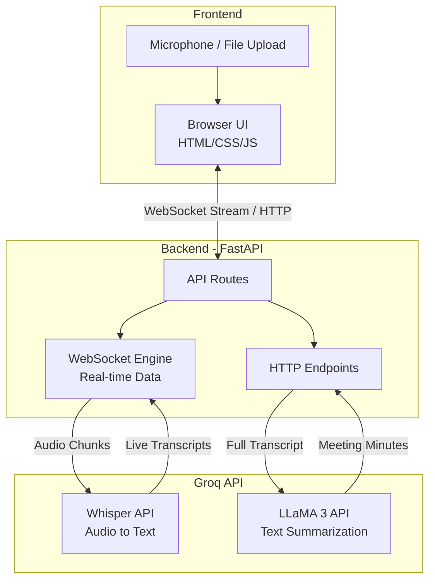

# AI MOM (AI Meeting Minutes)

A lightning-fast, beginner-friendly meeting transcription and summarization web application powered by the Groq API.

## Overview

This project is built from scratch in small modules to demonstrate clean architecture and seamless API integration. It uses:
- **FastAPI (Python)** for a robust and fast backend.
- **Vanilla HTML/CSS/JS** for a simple, dependency-free frontend.
- **Groq API** for ultra-fast Whisper transcription and LLaMA 3 meeting summarization.

## Architecture



## Setup Instructions (Day 1)

1. Clone this repository.
2. Navigate to the `backend` folder and create a virtual environment:
   ```bash
   python -m venv venv
   source venv/Scripts/activate  # Windows
   ```
3. Install dependencies:
   ```bash
   pip install -r requirements.txt
   ```
4. Copy `backend/.env.example` to `backend/.env` and add your Groq API key.
5. Run the development server:
   ```bash
   uvicorn main:app --reload
   ```
6. Visit `http://localhost:8000/` to ensure the server is running.
