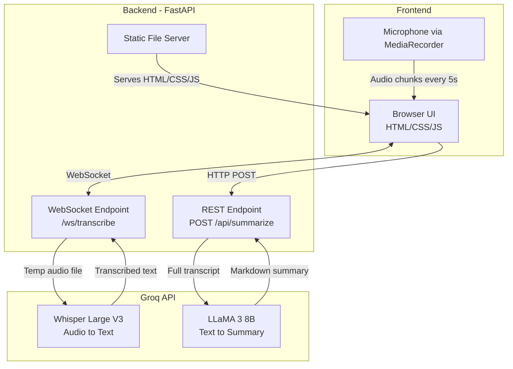

# AI MOM (AI Meeting Minutes)

A real-time meeting transcription and AI-powered summarization web application built with FastAPI and the Groq API.

## Overview

AI MOM captures live audio from your microphone, transcribes it in real-time using Groq's Whisper model, and then generates a clean summary of the entire meeting using LLaMA 3 - all through a simple web interface.

### What It Does

- **Live Transcription** - Records audio from your microphone and transcribes it in real-time via WebSockets.
- **AI Summarization** - Takes the full transcript and generates a structured summary with key decisions and action items.
- **Copy to Clipboard** - One-click copy for both the transcript and the summary.

### Tech Stack

| Layer | Technology |
|-------|-----------|
| Backend | Python, FastAPI, WebSockets |
| Frontend | HTML5, CSS3, Vanilla JavaScript |
| AI / Transcription | Groq API (Whisper Large V3) |
| AI / Summarization | Groq API (LLaMA 3 8B) |

## Architecture


```mermaid
graph TD
    subgraph Frontend
        A[Browser UI<br/>HTML/CSS/JS]
        B[Microphone via MediaRecorder]
    end

    subgraph Backend - FastAPI
        C[WebSocket Endpoint<br/>/ws/transcribe]
        D[REST Endpoint<br/>POST /api/summarize]
        E[Static File Server]
    end

    subgraph Groq API
        F[Whisper Large V3<br/>Audio to Text]
        G[LLaMA 3 8B<br/>Text to Summary]
    end

    B -->|Audio chunks every 5s| A
    A <-->|WebSocket| C
    A -->|HTTP POST| D

    C -->|Temp audio file| F
    F -->|Transcribed text| C

    D -->|Full transcript| G
    G -->|Markdown summary| D

    E -->|Serves HTML/CSS/JS| A
```

## Project Structure

```
AI-MOM/
├── backend/
│   ├── main.py             # FastAPI server (WebSocket + REST + Static files)
│   ├── requirements.txt    # Python dependencies
│   ├── .env.example        # Template for environment variables
│   └── .env                # Your actual Groq API key (not committed)
├── frontend/
│   ├── index.html          # Main web page
│   ├── styles.css          # Dark theme styling
│   └── app.js              # Mic recording, WebSocket, and UI logic
├── .gitignore
└── README.md
```

## Setup Instructions

### Prerequisites
- Python 3.9 or higher
- A free Groq API key from [console.groq.com](https://console.groq.com)

### Step 1: Clone the repository
```bash
git clone https://github.com/Avi3784/AI_MOM.git
cd AI_MOM
```

### Step 2: Create a virtual environment
```bash
cd backend
python -m venv venv
venv\Scripts\activate       # Windows
# source venv/bin/activate  # Mac/Linux
```

### Step 3: Install dependencies
```bash
pip install -r requirements.txt
```

### Step 4: Configure your API key
```bash
copy .env.example .env
```
Open `.env` and replace `your_groq_api_key_here` with your actual Groq API key.

### Step 5: Run the server
```bash
uvicorn main:app --reload
```

### Step 6: Open the app
Visit [http://localhost:8000](http://localhost:8000) in your browser (Chrome recommended).

## How to Use

1. Click **Start Meeting** and allow microphone access when prompted.
2. Start speaking. You will see the live transcript appear on the left panel.
3. When done, click **Stop Meeting**.
4. Click **Generate Summary** to get an AI-powered summary on the right panel.
5. Use the **Copy** buttons to copy the transcript or summary to your clipboard.

## How It Works (For Interviews)

1. The browser captures microphone audio using the Web Audio API and MediaRecorder.
2. Audio chunks (WebM format, 5-second intervals) are streamed to the FastAPI backend via a WebSocket connection.
3. Each chunk is saved as a temporary file and sent to Groq's Whisper Large V3 model for transcription.
4. The transcribed text is immediately sent back to the browser through the same WebSocket.
5. When the user clicks "Generate Summary", the full accumulated transcript is sent via a normal HTTP POST request to the `/api/summarize` endpoint.
6. The backend sends the transcript to Groq's LLaMA 3 model with a carefully crafted system prompt, and returns a structured Markdown summary.
7. The frontend renders the Markdown summary as formatted HTML.

## License

MIT
